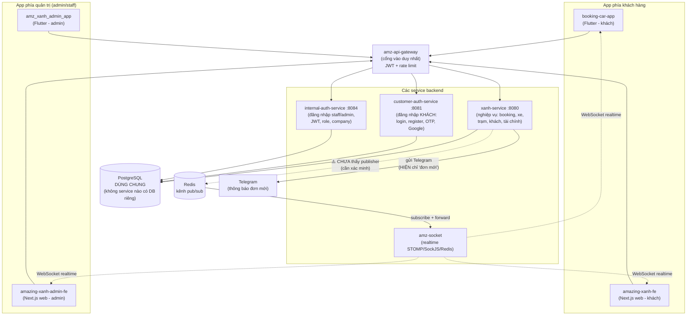

# Kiến trúc tổng thể hệ thống AMZ

> Ngày cập nhật: **2026-06-09**
> Tài liệu dành cho LEAD (rành backend). Mô tả bằng ngôn ngữ nghiệp vụ, tránh thuật ngữ frontend.

## 1. Sơ đồ tổng thể

Toàn bộ ứng dụng (app khách + admin) đều đi qua **một cổng chung** (gateway), gateway phân luồng tới các service backend. Các service đều đọc/ghi vào **một PostgreSQL DÙNG CHUNG**.



**Đọc sơ đồ bằng lời:**
- 4 ứng dụng (2 khách + 2 admin) **không gọi thẳng** vào service nào, mà luôn đi qua `amz-api-gateway`.
- Gateway kiểm tra JWT (token đăng nhập) + giới hạn số lần gọi (chống lạm dụng), rồi chuyển yêu cầu tới đúng service.
- `xanh-service` xử lý toàn bộ nghiệp vụ (đặt xe, xe, trạm, khách hàng, thu chi).
- `customer-auth-service` lo việc đăng nhập/đăng ký của **khách hàng** (kể cả đăng nhập Google, OTP, quên mật khẩu).
- `internal-auth-service` lo việc đăng nhập của **nhân viên/admin nội bộ**.
- → Hệ thống có **2 cửa đăng nhập tách biệt**: khách đi cửa `customer-auth`, nhân viên đi cửa `internal-auth`.
- **Thông báo (đã xác minh trong code 2026-06-09):** khi có **đơn mới**, `xanh-service` gửi một tin nhắn **Telegram** (vào nhóm theo vùng), chạy *sau khi lưu đơn thành công*. **Hiện tại CHỈ "đơn mới" được gửi thật** — các sự kiện khác (giao xe, nhận xe, hủy, hoàn cọc, KYC chờ duyệt...) đã viết code nhưng **đang tắt ở bước gửi** (bật lại được khi cần).
- **Realtime qua WebSocket:** `amz-socket` có nghe **Redis** và đẩy xuống app qua WebSocket (nó chỉ là **bộ chuyển tiếp**, không có nghiệp vụ riêng). NHƯNG ⚠️ **chưa tìm thấy chỗ nào trong `xanh-service` đẩy tin vào Redis** → tức là kênh realtime panel admin **hiện có thể chưa chạy với các sự kiện booking**. Cần xác minh ai là bên đẩy tin vào Redis trước khi dựa vào realtime này.
- Tất cả service ghi/đọc chung **một PostgreSQL**.

## 2. Bảng các thành phần

| Thành phần | Vai trò | Port | Công nghệ | Người dùng cuối |
|------------|---------|------|-----------|-----------------|
| **booking-car-app** | App đặt xe cho khách (đăng nhập, KYC CCCD/GPLX, tìm xe, đặt xe, thanh toán cọc, xem hợp đồng) | — (app di động) | Flutter | Khách hàng |
| **amazing-xanh-fe** | Web đặt xe cho khách (tìm xe, đặt xe, hồ sơ, lịch sử, blog) | 3000 (local dev) | Next.js + React | Khách hàng |
| **amazing-xanh-admin-fe** | Web quản trị (hợp đồng, giao/nhận xe, tài chính, danh sách, quản lý cấu hình, báo cáo, lịch xe) | 3000 (local dev) | Next.js App Router | Admin / nhân viên |
| **amz_xanh_admin_app** | App quản trị di động (booking, giao/nhận, xe, khách, tài chính, bảo dưỡng, khuyến mãi) | — (app di động) | Flutter | Admin / nhân viên |
| **amz-api-gateway** | Cổng vào duy nhất: định tuyến, kiểm tra JWT, giới hạn tần suất gọi | (gateway) | Spring Cloud Gateway | (hạ tầng) |
| **xanh-service** | Backend nghiệp vụ: booking, xe, trạm, khách hàng, KYC, khuyến mãi, bảo dưỡng, tài chính, báo cáo, CMS | **8080** | Java / Spring Boot | (qua app/admin) |
| **customer-auth-service** | Auth khách hàng: login, register, refresh-token, logout, đổi/quên mật khẩu, verify OTP, reset, profile, Google login, xóa tài khoản | **8081** | Java / Spring Boot | (qua app/web khách) |
| **internal-auth-service** | Auth nội bộ: đăng nhập staff/admin, JWT, role, company, đổi/quên mật khẩu | **8084** | Java / Spring Boot | (qua admin) |
| **amz-socket** | Realtime: nghe Redis, đẩy thông báo xuống app qua WebSocket (chỉ chuyển tiếp). ⚠️ Chưa rõ bên nào đẩy tin vào Redis | — | Spring Boot + STOMP/SockJS + Redis + JWT | (qua mọi app) |
| **PostgreSQL** | CSDL **dùng chung** cho mọi service | (DB) | PostgreSQL | (hạ tầng) |
| **Redis** | Kênh pub/sub mà `amz-socket` lắng nghe để forward realtime | (cache/bus) | Redis | (hạ tầng) |
| **Telegram** (ngoài) | Kênh thông báo đơn mới cho đội vận hành (chỉ `BookingCreated` đang bật) | — | Telegram Bot API | Đội vận hành |

> Ghi chú port: cả `amazing-xanh-fe` và `amazing-xanh-admin-fe` đều chạy local trên `localhost:3000` khi dev (chạy riêng từng cái). Phía backend: `xanh-service` 8080, `customer-auth-service` 8081, `internal-auth-service` 8084.

## 3. Quy ước quan trọng (BẮT BUỘC nhớ)

### 3.1. responseCode success khác nhau theo service
Luôn kiểm tra `response.responseCode`, **KHÔNG** chỉ dựa vào HTTP status (vd HTTP 200 không có nghĩa là nghiệp vụ thành công).

| Service | Mã success |
|---------|-----------|
| `xanh-service` | `"00"` |
| `customer-auth-service` | `"200"` |
| `internal-auth-service` | `"200"` |

Format response chung của `xanh-service`:
```json
{
  "response": { "responseCode": "00", "responseMessage": "...", "responseId": "...", "responseTime": "..." },
  "result": { ... }
}
```

### 3.2. Một DB chung — không service nào có DB riêng
- Toàn bộ service (`xanh-service`, `internal-auth-service`, ...) cùng đọc/ghi **một PostgreSQL duy nhất**.
- Hệ quả: đổi schema (thêm/sửa bảng, cột, khóa) phải cẩn trọng vì có thể ảnh hưởng nhiều service. Trước khi viết SQL migration phải mở entity `.java` lấy tên bảng THỰC TẾ (`@Table(name=...)`, vd `new_cars` chứ không phải `car`).

### 3.3. Không import cross-service entity
- Mỗi service có **bộ entity riêng** dù dùng chung DB.
- **KHÔNG** import entity của service khác. Không copy-paste code giữa `xanh-service` và auth service mà quên đổi `responseCode`.

## 4. Hai cửa đăng nhập tách biệt (khách vs nhân viên)

Hệ thống có **2 service auth riêng**, đừng nhầm lẫn:

| | Khách hàng | Nhân viên / Admin |
|---|---|---|
| Service | `customer-auth-service` :8081 | `internal-auth-service` :8084 |
| Dùng ở | app `booking-car-app`, web `amazing-xanh-fe` | web `amazing-xanh-admin-fe`, app `amz_xanh_admin_app` |
| Chức năng | login, register, refresh-token, logout, verify OTP, forgot/reset password, profile, **Google login**, xóa tài khoản | login staff/admin, JWT, role, company, đổi/quên mật khẩu |
| Mã success | `"200"` | `"200"` |

- Cùng dùng **một PostgreSQL chung** với `xanh-service` (khách lưu ở bảng `customers`, nhân viên ở bảng `users` — đừng nhầm 2 bảng này).
- Lưu ý bẫy: 2 bảng `user_identities` / `licenses` có cột tên `user_id` nhưng thực tế **trỏ `customers(id)`** (CCCD/GPLX của khách), KHÔNG phải bảng `users`.
- `CLAUDE.md` còn liệt kê `traffic-worker-service` (Python worker — schedule/crawler/jobs) nhưng repo này **không có trong workspace hiện tại**; nếu cần đụng tới worker, xác nhận với lead vị trí repo.

---
*Tài liệu này là bản đồ tổng quan. Chi tiết quy trình (bẫy nghiệp vụ, schema DB, sau-merge cleanup) xem `CLAUDE-deep.md`. Routing repo theo domain xem `CLAUDE.md`.*
