# Luong nghiep vu tong hop — End-to-end Khach → Admin

> Cap nhat: 2026-06-09 | Source: reverse-engineered tu khao sat moi be mat (xanh-service, internal-auth, amz-socket, gateway, admin-fe, Flutter admin app, customer app, customer web)
> Muc tieu: gom MOI nang luc he thong thanh danh sach luong nghiep vu day du. Moi domain backend + moi nhom man admin xuat hien o it nhat 1 luong.

---

## Cach doc tai lieu nay

- File nay **khong** thay the `user-journeys.md` (chi tiet vong doi booking) — no **bao quat hon**: ghep tat ca domain (booking, xe, khach, tai chinh, KYC, khuyen mai, bao duong, CMS, bao cao, cau hinh...) thanh tung luong end-to-end.
- Voi moi luong: (1) Khach lam gi o app/web khach, (2) Request di qua gateway → service → bang DB nao, (3) Realtime socket co ban gi khong, (4) Admin nhin thay/xu ly gi o panel.
- **Quy uoc service:** moi service dung CHUNG 1 PostgreSQL. "Bang DB" la suy luan tu ten entity nghiep vu, can grep `@Table(name=...)` de xac nhan ten that.
- **ResponseCode:** xanh-service = `"00"`, auth-service = `"200"`. Luon check `responseCode`, khong chi HTTP status.
- **Thong bao (DA XAC MINH 2026-06-09):** khi co **don moi**, xanh-service gui **Telegram** (`NotifyEvent.BookingCreated` → `NotifyEventListener`, chay sau khi commit). **HIEN CHI "don moi" duoc gui that**; cac event khac (giao xe, nhan xe, huy, hoan coc, KYC cho...) da co code nhung **dang tat o buoc gui**. → Cac dong **"Socket/Realtime"** o tung luong ben duoi (BOOKING_UPDATE, NEW_TRIP...) la **SAI/suy doan**: grep trong xanh-service **khong tim thay** `convertAndSend`/`RedisTemplate` → xanh-service KHONG day tin vao Redis. amz-socket co nghe Redis + day WebSocket nhung **chua ro ai la ben publish** → realtime panel admin co the **chua chay** voi su kien booking. Coi cac dong "Socket" ben duoi la **chua xac minh**.

---

## Muc luc cac luong

| # | Luong | Domain chinh |
|---|-------|--------------|
| [F01](#f01--khach-dang-ky--dang-nhap-tai-khoan) | Khach dang ky / dang nhap tai khoan | customer-auth |
| [F02](#f02--khach-bo-sung-kyc-cccd--bang-lai--admin-duyet) | Khach bo sung KYC (CCCD/bang lai) → Admin duyet | customer (KYC), storage |
| [F03](#f03--khach-tim-xe--xem-chi-tiet--xem-lich-xe) | Khach tim xe → xem chi tiet → xem lich xe | vehicle, location |
| [F04](#f04--khach-tinh-gia--ap-ma-khuyen-mai) | Khach tinh gia + ap ma khuyen mai | booking (calc), promotion |
| [F05](#f05--khach-dat-xe--admin-xac-nhan-don-moi) | Khach dat xe → Admin xac nhan don moi | booking, payment, socket |
| [F06](#f06--admin-giao-xe-cho-khach) | Admin giao xe cho khach | booking (delivery), finance |
| [F07](#f07--admin-nhan-xe--quyet-toan--phu-thu) | Admin nhan xe + quyet toan + phu thu | booking (receive), finance, surcharge |
| [F08](#f08--gia-han--doi-xe-giua-chung) | Gia han / doi xe giua chung | booking (extend, change-car) |
| [F09](#f09--huy-don--hoan-coc) | Huy don + hoan coc | booking (cancel, refund), finance |
| [F10](#f10--in-hop-dong-google-docs--pdf) | In hop dong (Google Docs / PDF) | booking (print), oauth |
| [F11](#f11--admin-quan-ly-danh-sach-xe--phap-ly--bao-duong) | Admin quan ly xe + phap ly + bao duong | vehicle, maintenance |
| [F12](#f12--admin-quan-ly-khach-hang--tai-khoan-ngan-hang) | Admin quan ly khach hang + tai khoan ngan hang | customer, finance |
| [F13](#f13--admin-quan-ly-tai-chinh-thuchi--bao-cao) | Admin quan ly tai chinh (thu/chi) + bao cao | finance, report |
| [F14](#f14--admin-cau-hinh-he-thong-phu-phi-mau-hd-phi-vung-ngan-hang) | Admin cau hinh he thong | system-config |
| [F15](#f15--admin-quan-ly-nhan-vien--phan-quyen) | Admin quan ly nhan vien + phan quyen | internal-auth (user/role/company) |
| [F16](#f16--admin-quan-ly-dia-diem-thanh-pho--ben-xe) | Admin quan ly dia diem (thanh pho + ben) | location |
| [F17](#f17--cms-bai-viet-noi-dung-trang-cau-hinh-site) | CMS: bai viet, noi dung trang, cau hinh site | post, page-content, site-setting |
| [F18](#f18--phat-nguoi--thong-bao-admin-sinh-nhat-bao-duong) | Phat nguoi + thong bao admin | traffic-violation, notification |
| [F19](#f19--dashboard--thong-ke) | Dashboard + thong ke | dashboard, report |
| [F20](#f20--khach-quan-ly-ho-so--xem-lich-su--noi-dung-cong-khai) | Khach quan ly ho so + lich su + noi dung | profile, booking-history, content |
| [F21](#f21--di-tru-du-lieu-anh-bai-viet-legacy--s3) | Di tru du lieu anh bai viet legacy → S3 | migration |
| [F22](#f22--admin-quan-ly-dich-vu-cho-thue-rent-services) | Admin quan ly dich vu cho thue (rent-services) | rent-service, pricing |
| [F23](#f23--duyet-phieu-bao-tri-yeu-cau--duyet-2-buoc) | Duyet phieu bao tri (yeu cau → duyet, 2 buoc) | maintain (request/approve) |
| [F24](#f24--doi-xe-do-su-co-loi-ky-thuat--tai-nan) | Doi xe do su co (loi ky thuat / tai nan) | booking (incident, change-car) |

> **Lich su vet sot (2026-06-09):** sau khi agent thanh tra do phu phat hien cac nhom man/endpoint chua nam trong F01–F21, da bo sung **F22 (dich vu cho thue)** va **F23 (duyet bao tri)**. Rieng man "Tai xe" (Flutter admin) lead xac nhan **CHUA CO nghiep vu** (chi la man de san, mock data) → khong tinh la 1 luong. Xem muc "Ghi chu kiem chung" cuoi file.

---

## Bang tong hop nhanh

| Luong | Khach lam gi | Service di qua | Admin xu ly gi |
|-------|--------------|----------------|----------------|
| F01 Dang ky/dang nhap | Dang ky SDT/email, nhap OTP, dang nhap (ke ca Google) | gateway → customer-auth | (Admin login rieng qua internal-auth) |
| F02 KYC | Upload CCCD + bang lai, cho duyet | gateway → storage(S3) + xanh-service | Duyet/tu choi KYC tai man Kyc-approval, OCR CCCD |
| F03 Tim xe | Tim xe ranh, xem chi tiet, xem lich | gateway → xanh-service | Quan ly xe + lich Gantt o panel |
| F04 Tinh gia | Tinh gia, nhap ma khuyen mai | gateway → xanh-service | Tao/sua ma khuyen mai |
| F05 Dat xe | Tao booking, chon coc | gateway → xanh-service (+socket) | Thay don moi PENDING, xac nhan |
| F06 Giao xe | (khong) — Admin thao tac | xanh-service | Mo dialog Giao xe, thu coc + tien thue |
| F07 Nhan xe | (khong) | xanh-service | Mo dialog Nhan xe, ghi phu thu, quyet toan |
| F08 Gia han/Doi xe | Khach yeu cau (hotline) | xanh-service | Gia han / doi xe tren panel |
| F09 Huy + hoan coc | Tu huy (neu cho phep) | xanh-service (+socket) | Xac nhan huy, hoan coc |
| F10 In hop dong | (khong) | xanh-service → Google Docs | In HD Google Docs / PDF |
| F11 Quan ly xe | (khong) | xanh-service | Tao/sua/xoa xe, bao duong |
| F12 Quan ly khach | (khong) | xanh-service | Tim/sua khach, xem TK ngan hang |
| F13 Tai chinh | (khong) | xanh-service | Phieu thu/chi, bao cao doanh thu/chi phi |
| F14 Cau hinh | (khong) | xanh-service | Phu phi, mau HD, phi vung, ngan hang |
| F15 Nhan vien | (khong) | gateway → internal-auth | Tao NV, gan role, gan cong ty, khoa/mo |
| F16 Dia diem | Xem thanh pho/ben (khi dat) | xanh-service | Tao/sua thanh pho + ben |
| F17 CMS | Xem bai viet, noi dung trang | xanh-service | Soan bai viet, noi dung trang, site setting |
| F18 Phat nguoi | (khong) | xanh-service (+socket) | Xem phat nguoi, thong bao sinh nhat/bao duong |
| F19 Dashboard | Xem dashboard khach | xanh-service | KPI hom nay, giao/nhan, KYC cho |
| F20 Ho so khach | Sua ho so, xem lich su, xem tin tuc | gateway → customer-auth + xanh-service | (gian tiep) |
| F21 Migration | (khong) | xanh-service → S3 | Bam di tru anh bai viet |
| F22 Dich vu thue | Xem ds dich vu (`/xanh/services`), gioi thieu | gateway → xanh-service | Tao/sua dich vu cho thue, anh huong tinh gia |
| F23 Duyet bao tri | (khong) | xanh-service | Tao yeu cau bao tri → duyet phieu (2 buoc) |
| F24 Doi xe su co | Bao xe loi/tai nan (hotline) | xanh-service | Bao su co → doi xe 2 buoc → giao xe moi |

---

## F01 — Khach dang ky / dang nhap tai khoan

**Domain:** `authentication` (customer-auth-service) · **Be mat khach:** customer app (Flutter) + customer web (Next.js)

1. **Khach lam gi:** Mo app/web → chon dang ky bang SDT hoac email → nhap thong tin → nhan ma OTP (6 so) → nhap OTP → tao mat khau. Lan sau dang nhap bang SDT + mat khau, hoac bam **Dang nhap voi Google**.
   - **Kenh gui OTP (DA XAC MINH 2026-06-09):** neu la **email** → gui qua **Email** (Brevo SMTP); neu la **SDT** → gui qua **Zalo ZNS** (mau tin Zalo). **KHONG co SMS** — he thong khong dung dich vu SMS nao.
2. **Duong di:** App/web goi BFF (`/api/auth/login`, `/api/auth/register`, `/api/auth/verify-otp`, `/api/auth/google-login`) → gateway → **customer-auth-service** (port 8081). Gateway gioi han dang ky chat (2 lan/phut) chong spam. Bang DB suy luan: `customers`, refresh token store. Auth tra ResponseCode `"200"`.
3. **Socket:** Khong.
4. **Admin nhin thay:** Khach moi xuat hien trong danh sach khach hang (F12) sau khi dang ky. Admin **khong** dang nhap qua luong nay — admin co luong rieng qua **internal-auth-service** (F15).

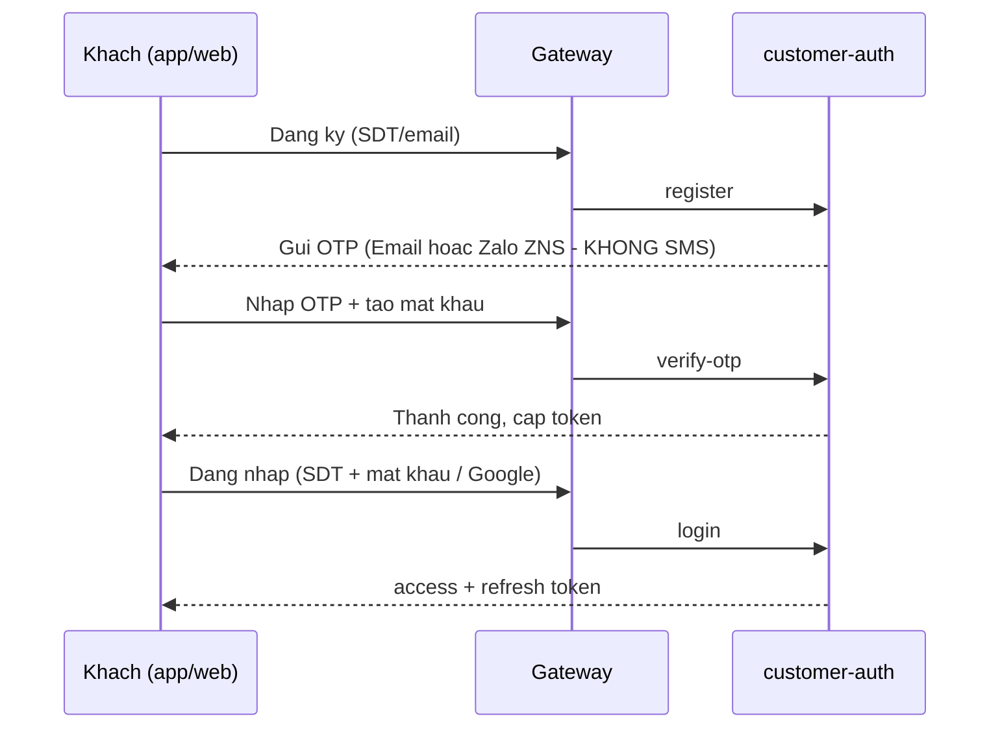

---

## F02 — Khach bo sung KYC (CCCD/bang lai) → Admin duyet

**Domain:** `customer` (KYC) + `storage` (xanh-service) · **Be mat khach:** customer app + web

1. **Khach lam gi:** Vao man **Dinh danh** → chup/tai anh CCCD mat truoc + sau, nhap so/ngay het han. Vao man **Bang lai** → tai anh bang lai, nhap hang/so/ngay het han. He thong bao trang thai: **Cho duyet / Da duyet / Tu choi (kem ly do)**.
2. **Duong di:** App xin **presigned URL** (`POST /xanh/storage/presigned-url`) → upload anh thang len **S3/MinIO** → gui objectKey ve qua `POST /xanh/customers/identity` va `POST /xanh/customers/license` → gateway → **xanh-service**. Bang DB suy luan: `user_identities`, `licenses` (luu y: cot ten `user_id` nhung **tro `customers(id)`**, khong phai bang users).
3. **Socket:** Co the ban `/topic/admin/notifications` bao "co KYC moi cho duyet" (suy luan — can xac nhan diem publish).
4. **Admin nhin thay/xu ly:**
   - Web admin: man **`/management/kyc-approval`** — danh sach KYC cho, loc theo CCCD/Bang lai, bam **Duyet** hoac **Tu choi** (nhap ly do).
   - Admin co the **OCR CCCD** (`/api/list/customer/ocr/cccd`) de tu dong dien thong tin (khong luu anh OCR).
   - Backend tuong ung: `customers/kyc/pending`, `identity/detail`, `license/detail`, `identity/reject`, `license/reject`, `ocr/cccd`.

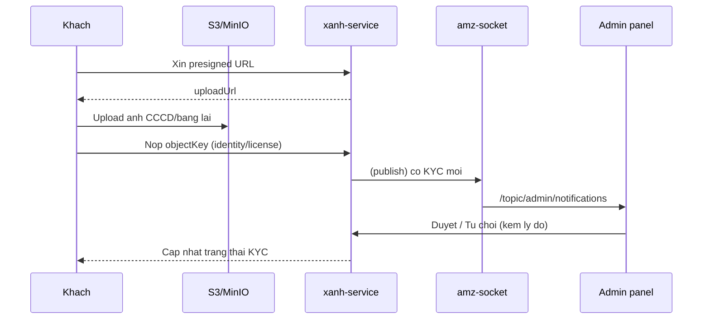

---

## F03 — Khach tim xe → xem chi tiet → xem lich xe

**Domain:** `vehicle` + `location` (xanh-service) · **Be mat khach:** customer app + web

1. **Khach lam gi:** Chon thoi gian nhan/tra + dia diem → tim **xe ranh** (don le hoac theo nhom spec+mau) → xem **chi tiet xe** (anh, dac tinh, gia, ben) → co the xem **lich xe** de biet xe ban hay ranh khoang nao.
2. **Duong di:** `POST /xanh/cars/available` · `available-grouped` · `cars/detail` · `cars/detail-by-slug` · `cars/schedule` · `check-group-availability`; dia diem qua `GET /xanh/cities` + `POST /xanh/stations/search`. Gateway → **xanh-service** (public, khong bat buoc auth). Bang DB suy luan: `new_cars`, `stations`, `cities`, va bang lich/booking de tinh r-anh.
3. **Socket:** Khong.
4. **Admin nhin thay/xu ly:** Quan ly cung tap xe nay o **`/list/car`**, **`/management/car`**, va **lich Gantt** (`/schedule` → `cars/search/schedule`). Trang thai/gia/ben do admin cau hinh se phan anh ngay sang ket qua tim cua khach.

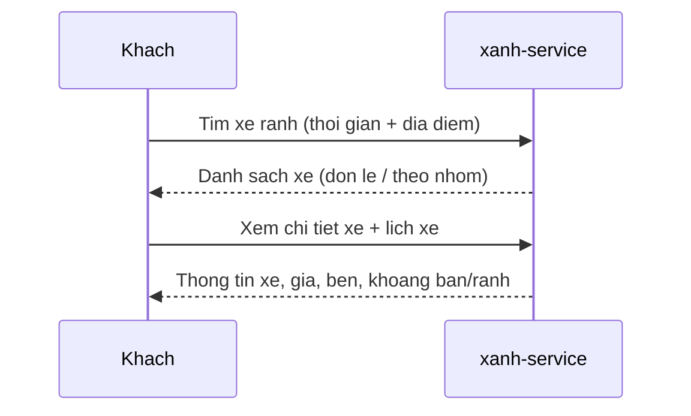

---

## F04 — Khach tinh gia + ap ma khuyen mai

**Domain:** `booking` (calculate-price) + `promotion` (xanh-service) · **Be mat khach:** customer app + web

1. **Khach lam gi:** Tren man dat xe → he thong **tinh gia** theo loai xe, thoi gian, dich vu, dia diem. Khach co the lay **danh sach ma khuyen mai kha dung** va **nhap ma** de xem gia sau giam.
2. **Duong di:** `POST /xanh/bookings/calculate-price`, `POST /xanh/promotions/available`, `POST /xanh/promotions/check` → gateway → **xanh-service**. Bang DB suy luan: `promotions`, bang gia xe/dich vu.
3. **Socket:** Khong.
4. **Admin nhin thay/xu ly:** Tao/sua/xoa ma khuyen mai o **`/management/promotion`** (`promotions/create`, `update`). Ma admin tao se hien trong danh sach kha dung va anh huong gia khach thay.

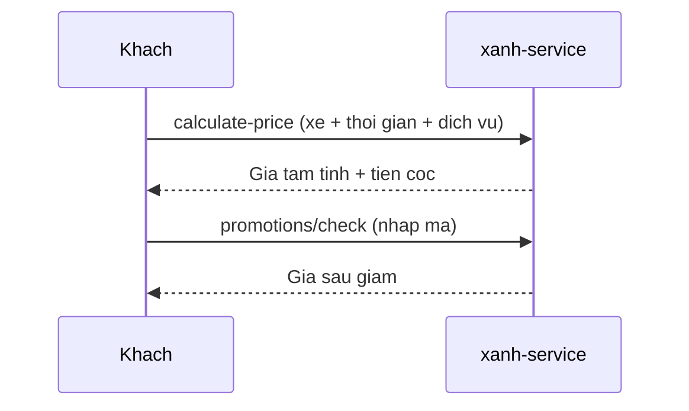

---

## F05 — Khach dat xe → Admin xac nhan don moi

**Domain:** `booking` + `payment` (xanh-service), `notification` (amz-socket) · **Be mat khach:** customer app + web

1. **Khach lam gi:** Nhap thong tin ca nhan, chon CCCD/bang lai da duyet, chon dia diem nhan/tra, chon **phuong thuc dat coc** (tien mat / chuyen khoan), xem lai → **xac nhan dat xe**.
2. **Duong di:** `POST /xanh/bookings/create` (luu `depositMethodId`) → gateway → **xanh-service**. Bang DB suy luan: `bookings`, `booking_logs`. Booking sinh ra o trang thai **PENDING (1)**.
3. **Socket:** Sau khi tao thanh cong, admin thay don moi (qua socket `NEW_TRIP`/`BOOKING_UPDATE` toi `/topic/admin/notifications`, **hoac** polling — can xac nhan diem publish).
4. **Admin nhin thay/xu ly:**
   - Web admin: don moi xuat hien o **`/contract/contract-day`** (loc trang thai "cho tien coc") va o **dashboard**.
   - Admin bam **Xac nhan** → PENDING (1) → CONFIRMED (2) (`bookings/update-status`). Auto-approve KYC khach neu can.

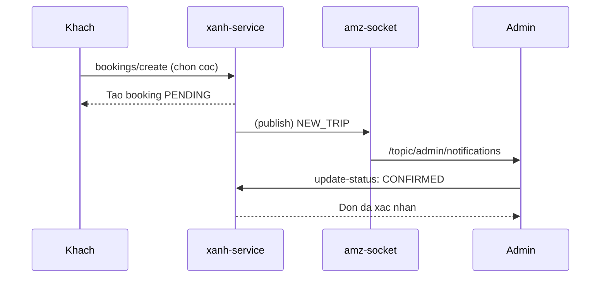

---

## F06 — Admin giao xe cho khach

**Domain:** `booking` (delivery) + `finance` (xanh-service) · **Be mat admin:** web admin + Flutter admin app

1. **Khach lam gi:** Den ben nhan xe (khong thao tac he thong).
2. **Duong di:** Admin mo **dialog Giao xe** → ghi km bat dau, anh/video tinh trang xe, **thu coc + tien thue** → `POST /xanh/admin/bookings/perform-delivery`. Booking CONFIRMED (2) / PENDING (1) → **ONGOING (3)**. Bang DB suy luan: `bookings`, `transactions` (PT DEPOSIT_COLLECT, PT RENTAL_PAYMENT), `booking_logs` (DELIVERY).
3. **Socket:** Co the ban `/user/{khach}/queue/notifications` ("xe da san sang / da giao") — suy luan.
4. **Admin nhin thay/xu ly:** Man **`/deliver-collect-car`** liet ke xe can giao hom nay (loc type=1 giao). Sau khi giao, sinh **2 phieu thu** xuat hien trong tab tai chinh (F13). Flutter admin app cung co `perform-delivery`.

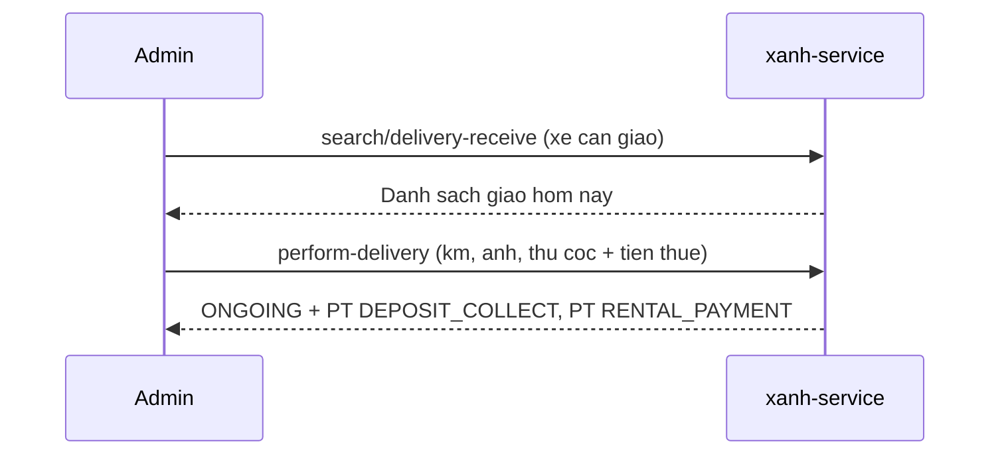

---

## F07 — Admin nhan xe + quyet toan + phu thu

**Domain:** `booking` (receive) + `finance` + `surcharge` (xanh-service) · **Be mat admin:** web admin + Flutter admin app

1. **Khach lam gi:** Tra xe tai ben (khong thao tac he thong).
2. **Duong di:** Admin mo **dialog Nhan xe** → ghi km ket thuc, anh/video, **them phu thu** neu co (`add-surcharge` / `remove-surcharge`, hoac lay `suggested-surcharges`), chon giu coc hay khong → `POST /xanh/admin/bookings/perform-receive`.
   - `isHoldDeposit=false` → **COMPLETED (4)**, hoan coc ngay.
   - `isHoldDeposit=true` → **REFUND_PENDING (6)**, cho kiem tra phu thu.
   - Bang DB suy luan: `bookings`, `transactions` (PT SURCHARGE_COLLECT), `booking_logs` (RECEIVE).
3. **Socket:** Co the ban toi khach ("da nhan xe / cho hoan coc") — suy luan.
4. **Admin nhin thay/xu ly:** Man **`/deliver-collect-car`** (type=2 nhan). Neu giu coc → don nam o trang thai cho hoan coc, xu ly tiep o F09. Admin co the **dong hop dong & quyet toan** (`bookings/finish`).

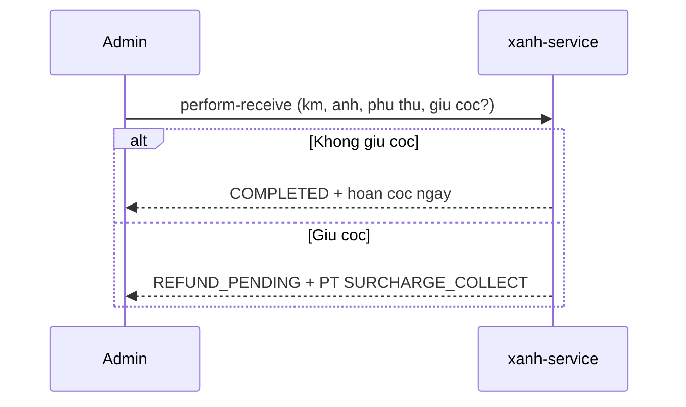

---

## F08 — Gia han / doi xe giua chung

**Domain:** `booking` (extend, change-car) (xanh-service) · **Be mat admin:** web admin + Flutter admin app

> Day la doi xe **tu nguyen** tren don dang chay (ONGOING). Doi xe do **su co/tai nan** (qua trang thai INCIDENT) la luong rieng — xem **F24**.

1. **Khach lam gi:** Goi hotline / yeu cau gia han hoac doi xe (khong tu thao tac).
2. **Duong di:**
   - **Gia han:** `POST /xanh/admin/bookings/extend` — keo dai thoi gian thue, tinh lai gia.
   - **Doi xe:** `POST /xanh/admin/bookings/change-car` (buoc van phong) → `POST /xanh/admin/bookings/change-car/deliver` (buoc hien truong). Booking giu nguyen ONGOING (3). Bang DB suy luan: `bookings`, `booking_logs` (CHANGE_CAR audit).
3. **Socket:** Khong bat buoc.
4. **Admin nhin thay/xu ly:** Sua trong man hop dong (`/contract/contract-day`) hoac tu **lich xe** (`/schedule`). Audit log ghi xe cu → xe moi (xem qua `booking-logs/get`).

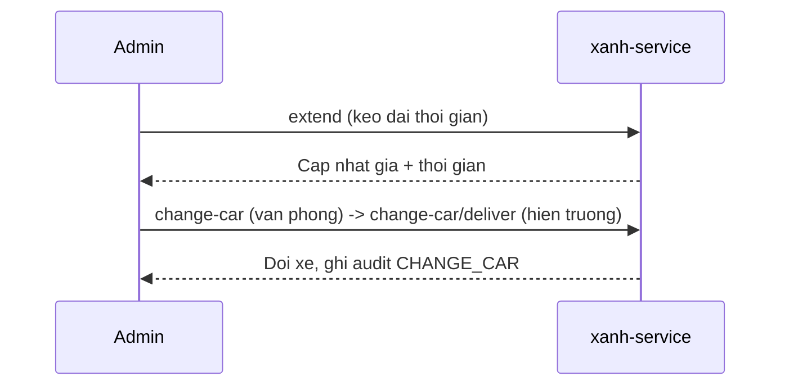

---

## F09 — Huy don + hoan coc

**Domain:** `booking` (cancel, confirm-refund) + `finance` (xanh-service) · **Be mat:** khach (huy som) + admin

1. **Khach lam gi:** Neu trang thai cho phep, khach **tu huy** tren app (`POST /xanh/bookings/cancel`). Khach cung co the luu **tai khoan ngan hang** de nhan hoan coc.
2. **Duong di:**
   - **Huy:** `bookings/cancel` (admin) hoac khach huy → CANCELLED (5), bat buoc `cancelReasonId`, ghi phi huy.
   - **Hoan coc:** sau REFUND_PENDING (6), admin **xac nhan hoan coc** `POST /xanh/admin/bookings/confirm-refund` → COMPLETED (4), tao **PC DEPOSIT_REFUND**. Bang DB suy luan: `bookings`, `transactions` (PC), `customer_bank_accounts`.
3. **Socket:** Co the ban toi khach ("refund duoc phe duyet") — type co san trong SocketMessage.
4. **Admin nhin thay/xu ly:** Man hop dong loc trang thai "hoan coc"; bam **Xac nhan hoan tra tien coc** (`contract/confirm-refund`). Lay TK ngan hang khach qua `bank-accounts/detail`.

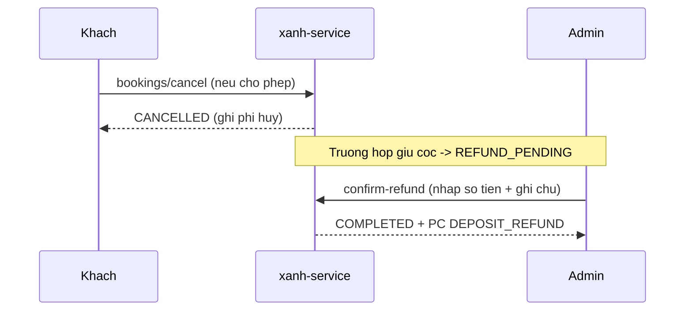

---

## F10 — In hop dong (Google Docs / PDF)

**Domain:** `booking` (print) + `oauth` (xanh-service) · **Be mat admin:** web admin

1. **Khach lam gi:** Ky hop dong giay tai ben (khong thao tac he thong).
2. **Duong di:** Admin bam in → `print-data` lay du lieu → `print-google-doc` (copy template Google Docs, fill placeholder) hoac `print-contract-pdf` (PDF binary). Ket noi Google qua `google/connect` → `google/callback` → `google/status`. Bang DB suy luan: `contract_templates`, token Google.
3. **Socket:** Khong.
4. **Admin nhin thay/xu ly:** Man hop dong co nut **In** (`/api/booking/contract/print`). Quan ly **mau hop dong** o cau hinh (F14). Lan dau phai **ket noi Google** o man Setting.

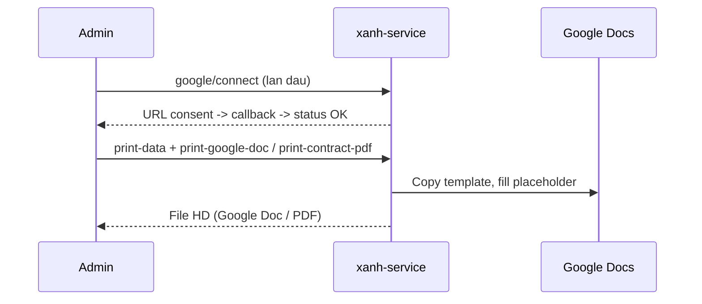

---

## F11 — Admin quan ly danh sach xe + phap ly + bao duong

**Domain:** `vehicle` + `maintenance` (xanh-service) · **Be mat admin:** web admin + Flutter admin app

> **Phieu bao duong TU DONG doi trang thai xe:** phieu **PENDING** → xe sang **MAINTENANCE (2)** → bien mat khoi tim xe ranh (query yeu cau status=1); phieu **COMPLETED** → xe ve **ACTIVE (1)** → dat lai duoc. Mac dinh khong truyen status = COMPLETED. Chan dat xe dua vao **trang thai xe**, KHONG theo ngay phieu. Chi tiet + nhanh tai nan→xuong: xem `luong-bao-duong-chi-tiet.html`. (⚠️ hủy phiếu CANCELLED khong tu dua xe ve ACTIVE.)

1. **Khach lam gi:** Gian tiep — xe admin tao/sua se hien khi khach tim (F03).
2. **Duong di:** `cars/create`, `cars/update`, `cars/update-legal-maintenance`, `cars/search`, `cars/detail`, `cars/delete`, `cars/license-plates`, `cars/search/schedule`; bao duong: `maintenance/create`, `maintenance/search`. Bang DB suy luan: `new_cars`, bang phap ly/bao hiem, `maintenances`.
3. **Socket:** Khong.
4. **Admin nhin thay/xu ly:**
   - **`/list/car`** + **`/list/car/[id]`** + **`/management/car`**: tao/sua/xoa xe.
   - **`/management/maintenance`**: lich bao duong, tao phieu, cap nhat trang thai. Loai bao duong + doi tac lay tu `maintenance/configs`.
   - **`/schedule`**: lich xe theo tuan/Gantt.

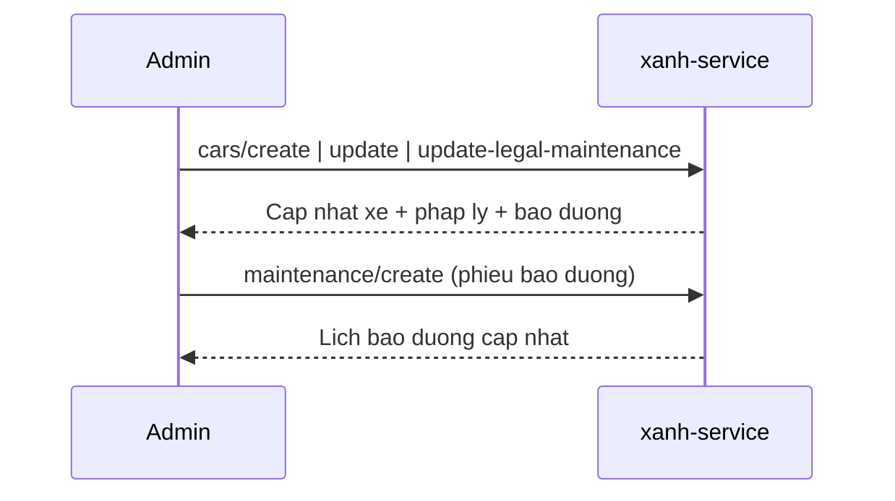

---

## F12 — Admin quan ly khach hang + tai khoan ngan hang

**Domain:** `customer` (xanh-service) · **Be mat admin:** web admin + Flutter admin app

1. **Khach lam gi:** Gian tiep — ho so/KYC khach do admin xem va sua.
2. **Duong di:** `customers/search`, `customers/create`, `customers/update`, `customers/detail`, `customers/delete`, `identity/update`, `license/update`, `bank-accounts/detail`. Bang DB suy luan: `customers`, `user_identities`, `licenses`, `customer_bank_accounts`.
3. **Socket:** Khong.
4. **Admin nhin thay/xu ly:** Man **`/list/customer`** — loc theo rank/KYC, tao/sua/xoa, xem chi tiet KYC, xem TK ngan hang (de hoan coc). Lien thong voi F02 (duyet KYC) va F09 (hoan coc).

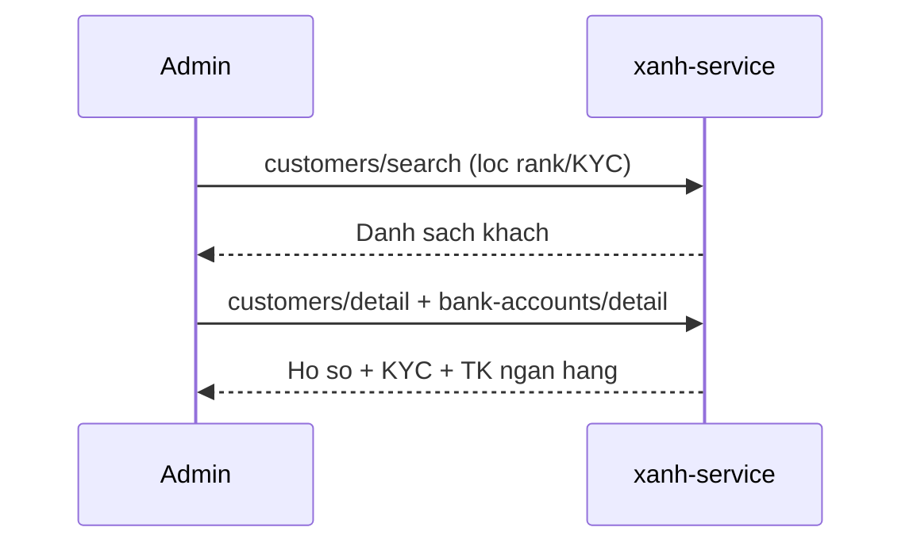

---

## F13 — Admin quan ly tai chinh (thu/chi) + bao cao

**Domain:** `finance` + `report` (xanh-service) · **Be mat admin:** web admin + Flutter admin app

1. **Khach lam gi:** Khong truc tiep — giao dich sinh ra tu giao/nhan xe/hoan coc (F06–F09).
2. **Duong di:** `transactions/create`, `transactions/search`, `transactions/void`, `transactions/export-excel`, danh muc `configs/transaction-categories`; bao cao `reports/revenue`, `reports/expenses`, `reports/customer-revenue`, `reports/rental-profit`, `reports/fill-rate`. Bang DB suy luan: `transactions`, `transaction_categories`.
3. **Socket:** Co the ban `/topic/admin/notifications` ("bao cao doanh thu") cho giao dich lon — suy luan.
4. **Admin nhin thay/xu ly:**
   - **`/finance/transactions`**: phieu thu/chi, loc loai/danh muc/ngay, tao phieu, huy phieu, xuat Excel.
   - **`/finance/debt`**: cong no (chua trien khai day du).
   - **`/report/*`**: doanh thu, chi phi, khach, loi nhuan, ty le su dung xe (fill-rate), bao cao ngay.
   - **Cach tinh fill-rate** (GROSS/NET, chia ngay khi doi xe, bao duong ghi de): xem `02-technical/cach-tinh-ty-le-lap-day.md`.

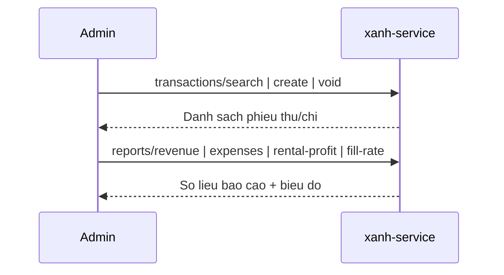

---

## F14 — Admin cau hinh he thong (phu phi, mau HD, phi vung, ngan hang)

**Domain:** `system-config` (xanh-service) · **Be mat admin:** web admin + Flutter admin app

1. **Khach lam gi:** Gian tiep — phu phi/phi vung/phuong thuc thanh toan anh huong gia khach.
2. **Duong di:** `configs/surcharges`, `configs/bank-accounts`, `payment-methods`, `contract-templates/*`, `configs/cross-region-fees/*`. Bang DB suy luan: `surcharges`, `bank_accounts`, `contract_templates`, `cross_region_fees`.
3. **Socket:** Khong.
4. **Admin nhin thay/xu ly:** Man **`/setting`** — dich vu, loai phieu, nguon khach, hang xe, mau in (mau hop dong), **phi chuyen vung**, ket noi Google. Phu phi quan ly o **`/finance`** (surcharge/get|create|delete). Ngan hang o **`/management/bank`** + **`/list/bank`**.

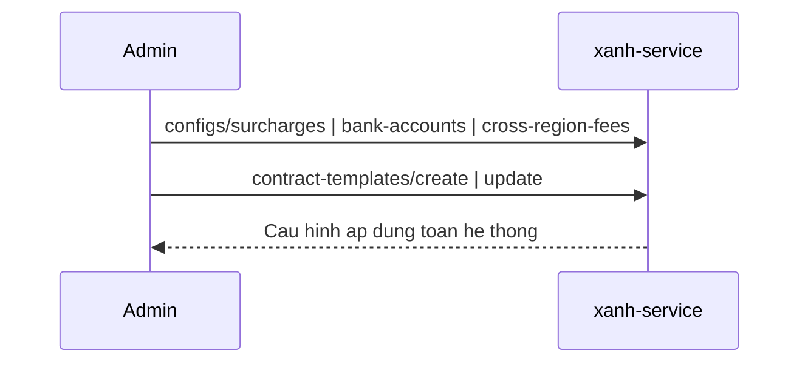

---

## F15 — Admin quan ly nhan vien + phan quyen

**Domain:** `user-management` + `role-management` + `company-assignment` + `password-administration` (internal-auth-service) · **Be mat admin:** web admin + Flutter admin app

1. **Khach lam gi:** Khong lien quan (khach dung customer-auth rieng).
2. **Duong di:** Admin login qua **internal-auth** (`/auth/admin/login`, `refresh-token`, `forgot-password`, `verify-otp`, `reset-password`, `change-password`). Quan ly NV: `create-user`, `profile`, `profile/update`, `users/{id}/deactivate|reactivate`. Role: `grant-role`, `set-role`, `roles`, `users/batch-roles`. Cong ty: `assign-company`. Mat khau: `admin-reset-password`. Gateway → **internal-auth-service** (port 8084). ResponseCode `"200"`. Bang DB suy luan: `users`, `roles`, `user_roles`, `companies`, `user_companies`.
3. **Socket:** Khong.
4. **Admin nhin thay/xu ly:** Man **`/management/staff`** — tim, tao NV, sua, **doi mat khau**, **vo hieu hoa / kich hoat lai**, gan/cap nhat **vai tro** (ROLE_ADMIN, ROLE_XANH, ROLE_STAFF). Non-admin staff chi thay data ben minh. Man **`/account`** la ho so ca nhan NV dang dang nhap.

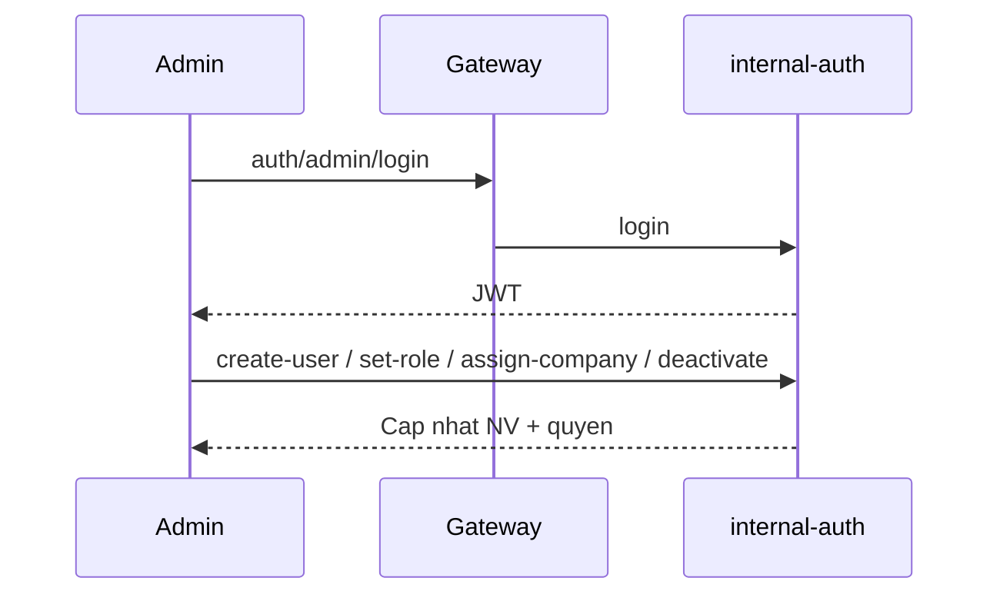

---

## F16 — Admin quan ly dia diem (thanh pho + ben xe)

**Domain:** `location` (xanh-service) · **Be mat admin:** web admin + Flutter admin app

1. **Khach lam gi:** Xem danh sach thanh pho + tim ben khi dat xe (F03).
2. **Duong di:** `cities/create|update|delete|search|detail|export-excel`, `stations/create|update`, `stations/search`. Public: `GET /xanh/cities`, `POST /xanh/stations/search`. Bang DB suy luan: `cities`, `stations`.
3. **Socket:** Khong.
4. **Admin nhin thay/xu ly:** Man **`/management/city`** (tao/sua/xoa/xuat Excel) va **`/management/location`** (ben xe, loc theo thanh pho/trang thai). Ben/thanh pho admin tao se xuat hien cho khach chon khi dat.

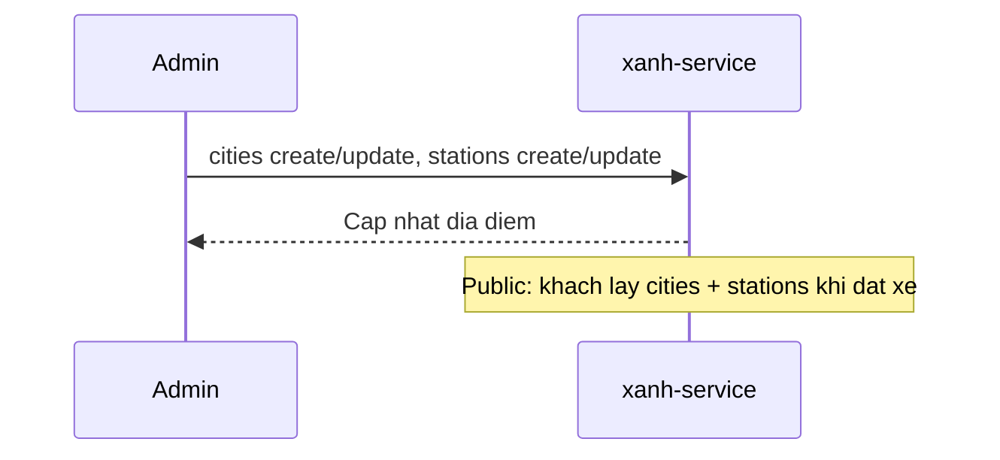

---

## F17 — CMS: bai viet, noi dung trang, cau hinh site

**Domain:** `post` + `page-content` + `site-setting` (xanh-service) · **Be mat:** khach (xem) + admin (soan)

1. **Khach lam gi:** Doc **tin tuc/blog** (`posts/get-all`, `hot-news`, `detail`, `by-path`), xem **noi dung trang** (banner, gioi thieu, khuyen mai qua `page-contents/list`) va **cau hinh site** (logo, SDT, dia chi qua `site-settings/list`).
2. **Duong di:** Public read (co cache). Admin: `posts/create|update|delete|search`, `page-contents/update`, `site-settings/update`. Gateway → **xanh-service**. Bang DB suy luan: `posts`, `page_contents`, `site_settings`.
3. **Socket:** Khong.
4. **Admin nhin thay/xu ly:** Web admin co domain CMS; customer-web cung co **khu admin rieng** (`/admin/posts`, `/admin/settings`) soan bai viet + landing page. Flutter admin app co man **Tin tuc** va **Banner**.

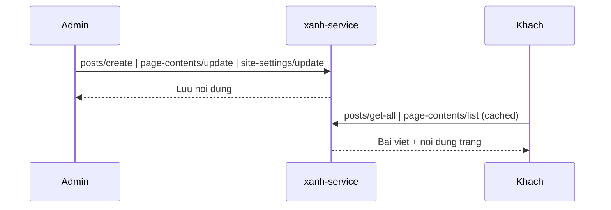

---

## F18 — Phat nguoi + thong bao admin

**Domain:** `traffic-violation` + `notification` (xanh-service, amz-socket) · **Be mat admin:** web admin + Flutter admin app

1. **Khach lam gi:** Khong truc tiep (lien quan xe khach dang thue).
2. **Duong di:** `traffic-violations/search`; thong bao admin: `notifications/birthdays`, `notifications/maintenance-due`, `notifications/traffic-violations`. Bang DB suy luan: `traffic_violations`, du lieu sinh nhat khach + lich bao duong.
3. **Socket:** Thong bao co the day qua `/topic/admin/notifications` (sinh nhat khach, bao duong den han, phat nguoi moi) — type ADMIN trong SocketMessage.
4. **Admin nhin thay/xu ly:** Man **`/management/traffic-violation`** tra cuu phat nguoi theo bien so/thoi gian. Thong bao sinh nhat/bao duong hien tren chuong bao admin / dashboard.

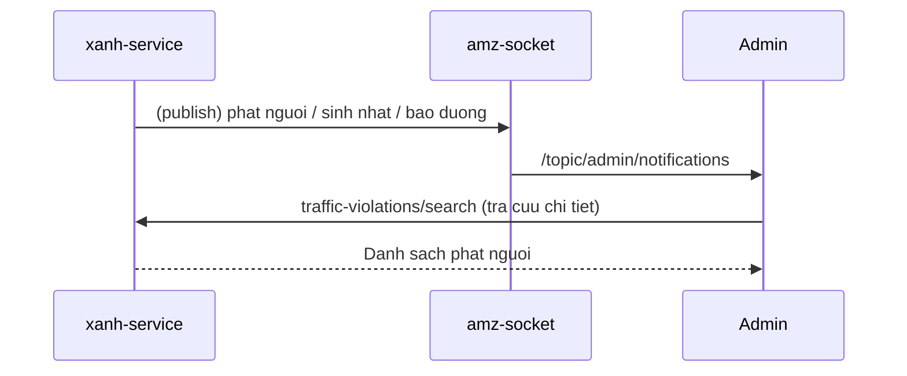

---

## F19 — Dashboard + thong ke

**Domain:** `dashboard` + `report` (xanh-service) · **Be mat:** khach (dashboard khach) + admin (dashboard admin)

1. **Khach lam gi:** Xem **dashboard khach** (`GET /xanh/dashboard`, `GET /xanh/statistics`): chuyen sap toi, thong ke so lan dat, quang cao, khuyen mai.
2. **Duong di:** Khach → gateway → xanh-service. Admin dashboard tong hop tu `bookings/status-counts`, `delivery/search`, `kyc/pending`.
3. **Socket:** Co the cap nhat realtime KPI (suy luan).
4. **Admin nhin thay/xu ly:** Man **`/`** (dashboard admin): KPI hom nay (giao xe, nhan xe, KYC cho, dang thue), danh sach giao/nhan hom nay, KYC cho duyet. Flutter admin app co man **Trang chu** + **Bao cao**.

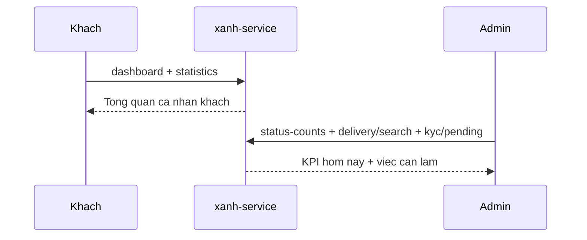

---

## F20 — Khach quan ly ho so + xem lich su + noi dung cong khai

**Domain:** `profile` + `booking-history` + `content` (customer-auth + xanh-service) · **Be mat khach:** customer app + web

1. **Khach lam gi:** Xem/sua **ho so** (ten, SDT, email, dia chi, gioi tinh, ngay sinh, avatar), **doi mat khau**, **xoa tai khoan**; xem **lich su dat xe** + chi tiet; quan ly **tai khoan ngan hang** (de hoan coc); xem **voucher/khuyen mai**, **tin tuc**, **gioi thieu**, **chinh sach**.
2. **Duong di:** Ho so qua `xanh/customers/profile` + `auth/customers/profile`; lich su `bookings/my-history` + `bookings/detail` (hoac `/api/profile/booking-history`); TK ngan hang `customer/bank-accounts`; doi mat khau/xoa TK qua customer-auth. Gateway → customer-auth + xanh-service.
3. **Socket:** Khong.
4. **Admin nhin thay/xu ly:** Gian tiep — ho so/lich su khach hien o F12; TK ngan hang dung khi hoan coc (F09).

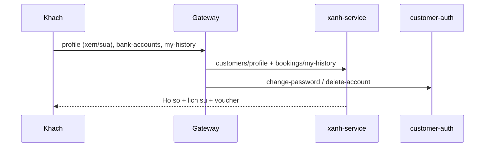

---

## F21 — Di tru du lieu anh bai viet legacy → S3

**Domain:** `migration` (xanh-service) · **Be mat admin:** web admin (cong cu noi bo)

1. **Khach lam gi:** Khong.
2. **Duong di:** Admin bam chay `POST /xanh/admin/migration/posts` → tai anh bai viet tu server legacy → upload S3 → cap nhat URL. Bang DB suy luan: `posts` (cap nhat URL anh).
3. **Socket:** Khong.
4. **Admin nhin thay/xu ly:** Cong cu mot lan, chay khi can chuyen anh cu sang S3; ket qua phan anh o CMS bai viet (F17).

```mermaid
sequenceDiagram
    participant AD as Admin
    participant X as xanh-service
    participant S3 as S3
    AD->>X: migration/posts (bam chay)
    X->>S3: Tai anh legacy -> upload S3
    X-->>AD: Cap nhat URL anh bai viet
```

---

## F22 — Admin quan ly dich vu cho thue (rent-services)

**Domain:** `rent-service` (xanh-service) · **Be mat admin:** web admin (`/management/service`) + app admin Flutter

1. **Khach lam gi:** Xem danh sach **dich vu di kem** khi dat xe qua `GET /xanh/services` (vd: tai xe rieng, giao xe tan noi, ghe tre em...); cac dich vu nay **anh huong gia** o buoc tinh gia (F04, `calculate-price` co tinh phi dich vu).
2. **Duong di:** Admin quan ly qua man `/management/service` → BFF `/api/management/service/get-all` → xanh-service; app admin Flutter doc `GET /xanh/admin/configs/rent-services`. Khach doc `GET /xanh/services`. Bang DB suy luan: `rent_services` (can grep `@Table` xac nhan).
3. **Socket:** Khong.
4. **Admin nhin thay/xu ly:** Tao/sua/bat-tat dich vu cho thue, dat gia/phi → dich vu hien ra cho khach chon khi dat va cong vao tong gia.

```mermaid
sequenceDiagram
    participant K as Khach
    participant AD as Admin
    participant G as Gateway
    participant X as xanh-service
    AD->>G: /api/management/service/get-all (quan ly)
    G->>X: rent-services (CRUD)
    K->>G: GET /xanh/services (khi dat xe)
    G->>X: Lay ds dich vu + phi
    X-->>K: Dich vu di kem -> cong vao tinh gia (F04)
```

---

## F23 — Duyet phieu bao tri (yeu cau → duyet, 2 buoc)

**Domain:** `maintain` (xanh-service) · **Be mat admin:** web admin (`/maintain/maintainance-request` + `/maintain/maintainance-approve`)

> Phan biet voi **F11** (tao phieu **bao duong** xe tu `/management/maintenance`). Nhom man `/maintain/*` la quy trinh **2 buoc co duyet** (de nghi → phe duyet), tach rieng. Ca hai con co the **chua trien khai day du** — can xac nhan dia chi BFF that.
>
> **Luu y:** thu tu dong doi trang thai xe (PENDING→MAINTENANCE, COMPLETED→ACTIVE) nam o phieu bao duong **F11**, KHONG phai o luong duyet 2 buoc nay. Chi tiet co che: `luong-bao-duong-chi-tiet.html`.

1. **Khach lam gi:** Khong (noi bo admin/ky thuat).
2. **Duong di:** Nhan vien tao **yeu cau bao tri** o man `/maintain/maintainance-request` → cap quan ly **duyet** o man `/maintain/maintainance-approve` → xanh-service ghi nhan. Bang DB suy luan: `maintenance_requests` / `maintenances` (can grep `@Table` xac nhan).
3. **Socket:** Co the ban thong bao cho nguoi duyet (du kien, chua xac nhan).
4. **Admin nhin thay/xu ly:** Buoc 1 — tao de nghi bao tri (xe nao, hang muc, chi phi du kien). Buoc 2 — quan ly xem va duyet/tu choi. Sau khi duyet, xe co the chuyen trang thai bao tri (lien quan F11 + lich xe F03).

```mermaid
sequenceDiagram
    participant NV as Nhan vien
    participant QL as Quan ly
    participant X as xanh-service
    NV->>X: Tao yeu cau bao tri (/maintain/maintainance-request)
    X-->>QL: Phieu cho duyet
    QL->>X: Duyet / tu choi (/maintain/maintainance-approve)
    X-->>X: Cap nhat trang thai xe (lien quan F11)
```

---

## F24 — Doi xe do su co (loi ky thuat / tai nan)

**Domain:** `booking` (incident + change-car) (xanh-service) · **Be mat admin:** web admin + Flutter admin app

> Phan biet voi **F08** (doi xe tu nguyen tren ONGOING). Luong nay danh cho xe **gap su co** giua chung: di qua trang thai **INCIDENT (7)** roi moi doi xe. Da co va kha day du trong code (state machine 9 trang thai).

1. **Khach lam gi:** Xe dang thue gap **loi ky thuat** hoac **tai nan** → khach bao hotline / nhan vien hien truong (khong tu thao tac he thong).
2. **Duong di (3 buoc):**
   - **B1 — Bao su co:** `POST /xanh/admin/bookings/update-status` ONGOING (3) → **INCIDENT (7)**, **bat buoc** kem `incidentType` = `TECHNICAL_FAULT` (loi ky thuat) hoac `ACCIDENT` (tai nan). Sai/thieu type → reject.
   - **B2 — Doi xe (van phong):** `POST /xanh/admin/bookings/change-car` INCIDENT (7) → **CHANGING_CAR (9)**, chot xe moi + **tien chenh lech**. Ghi log `CHANGE_CAR_OFFICE`. (Chi duoc doi xe khi dang INCIDENT.)
   - **B3 — Giao xe moi (hien truong):** `POST /xanh/admin/bookings/change-car/deliver` → giao xe thay the, quay lai **ONGOING (3)**. Ghi log `CHANGE_CAR_DELIVERY`.
   - Bang DB: `new_bookings` (status + `incidentType`), `booking_logs`, `booking_car_history`.
3. **Socket/Thong bao:** khi bao su co, code publish `NotifyEvent.IncidentRaised` (Telegram) — **nhung hien chi `BookingCreated` dang bat** nen su co **chua gui thong bao that** (xem canh bao dau trang).
4. **Admin nhin thay/xu ly:** Bao cao co bo loc trang thai su co (7/8). Ngoai doi xe, tu INCIDENT con co the:
   - **Bao nham** → ONGOING (3) (clear incidentType).
   - **Ket thuc HD som** → REFUND_PENDING (6) (`perform-receive` chap nhan ca INCIDENT).
   - **Tich thu xe** → SEIZED (8).

```mermaid
sequenceDiagram
    participant K as Khach
    participant NV as NV hien truong
    participant AD as Admin
    participant X as xanh-service
    K->>NV: Bao xe loi ky thuat / tai nan
    NV->>X: update-status sang INCIDENT (TECHNICAL_FAULT / ACCIDENT)
    AD->>X: change-car (chot xe moi + tien chenh)
    X-->>AD: CHANGING_CAR (log CHANGE_CAR_OFFICE)
    AD->>X: change-car/deliver (giao xe moi)
    X-->>K: Xe thay the, ve ONGOING
```

---

## Ghi chu kiem chung (BAT BUOC doc truoc khi tin tuyet doi)

- **Socket "ban gi" (DA XAC MINH 2026-06-09 — KET QUA: cac dong socket o tren KHONG dung):** xanh-service **khong** publish Redis (grep `convertAndSend`/`RedisTemplate` = 0 hit). Thong bao don moi that su di qua **Telegram** va **chi `BookingCreated`** dang bat. `amz-socket` co nghe Redis + day WebSocket nhung chua tim thay ben publish → realtime panel admin co the chua chay voi su kien booking. **Khong dua vao cac dong "Socket" trong tung luong** cho den khi xac minh duoc ben day Redis.
- **Ten bang DB (DA XAC MINH 2026-06-09):** xem **bang tra ten bang** ngay duoi. Nhieu bang co tien to `new_` (vd `new_bookings`, `new_cars`, `new_station_locations`). Dung dung ten nay khi viet SQL.
- **user_identities / licenses:** cot ten `user_id` nhung tro `customers(id)` (CCCD/GPLX khach), KHONG phai bang `users`.
- **2 luong auth song song:** khach qua customer-auth (8081, code "200"), nhan vien qua internal-auth (8084, code "200"); nghiep vu qua xanh-service (8080, code "00").
- **Trang thai booking chi tiet:** xem `state-machine.md` + `user-journeys.md` cho cac canh ngoai le (revert, su co, tich thu).
- **Do phu (coverage) — ket qua thanh tra 2026-06-09:** lan dau tai lieu chi co F01–F21, agent thanh tra bao FLAG vi sot vai nhom. Da bo sung **F22 (dich vu cho thue rent-services)** va **F23 (duyet bao tri 2 buoc `/maintain/*`)**. 2 endpoint cong khai `GET /xanh/about` + `GET /xanh/services` da gom vao **F20** (about) va **F22** (services). Rieng man **"Tai xe" (Flutter admin) → lead xac nhan CHUA CO nghiep vu** (chi la man de san, mock data), nen KHONG dua vao danh sach luong; khi nao mo nghiep vu tai xe that thi them luong moi. Sau khi va, moi domain backend + nhom man admin **dang co that** deu nam trong it nhat 1 luong.

---

## Bang tra ten bang DB that (DA XAC MINH tu `@Table` trong xanh-service, 2026-06-09)

> Dung **ten o cot phai** khi viet SQL. Chu y nhieu bang co tien to `new_`. (Khong co bang `drivers` → xac nhan nghiep vu tai xe chua co.)

| Nghiep vu | Entity (.java) | Ten bang THAT |
|-----------|----------------|---------------|
| Don dat xe | Booking | **`new_bookings`** |
| Xe | Car | **`new_cars`** |
| Thong so xe | CarSpecification | `new_car_specifications` |
| Anh xe | CarImage | `new_car_images` |
| Ben/diem | StationLocation | **`new_station_locations`** |
| Thanh pho | City | `cities` |
| Nguon don | BookingSource | `new_booking_sources` |
| Cau hinh gia | PriceConfiguration | `new_price_configurations` |
| Dich vu thue (F22) | RentService | **`new_rent_services`** |
| Khach hang | Customer | `customers` |
| CCCD khach | UserIdentity | `user_identities` *(cot `user_id` tro `customers`)* |
| GPLX khach | UserLicense | `user_licenses` *(tro `customers`)* |
| TK ngan hang | BankAccount | `bank_accounts` |
| Khuyen mai | Promotion / PromotionUsage | `promotions` / `promotion_usages` |
| Phu thu don | BookingSurcharge | `booking_surcharges` |
| Danh muc phu thu | SurchargeCatalog | `surcharge_catalogs` |
| Thu/chi | Transaction / TransactionCategory | `transactions` / `transaction_categories` |
| Phi lien vung | CrossRegionFeeConfig | `cross_region_fee_configs` |
| Mau hop dong | ContractTemplate / ...Type | `contract_templates` / `contract_template_types` |
| Phieu bao tri (F11/F23) | MaintenanceTicket / ...Category | `maintenance_tickets` / `maintenance_categories` |
| Doi tac | Partner | `partners` |
| Bai viet (CMS) | Post / PostUrlHistory | `posts` / `post_url_history` |
| Noi dung trang | PageContent | `page_contents` |
| Cau hinh site | SiteSetting | `site_settings` |
| Phat nguoi | TrafficViolation | `traffic_violations` |
| Ly do huy | CancelReason | `cancel_reasons` |
| Log don | BookingLog | `booking_logs` |
| Lich su xe-don | BookingCarHistory | `booking_car_history` |
| Token Google (in HD) | GoogleOAuthToken | `google_oauth_tokens` |
| Ho so nhan vien | StaffProfile | `staff_profiles` |
